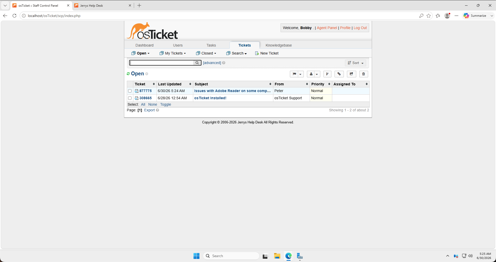
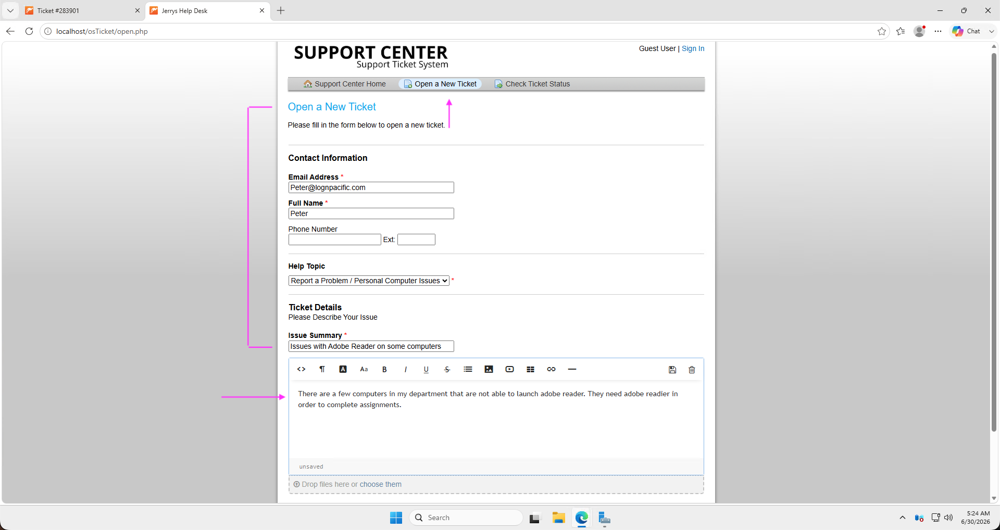
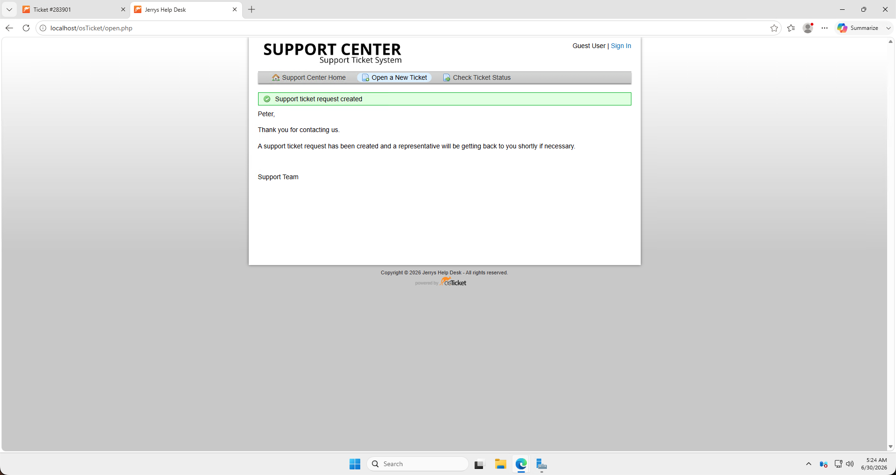

<h1>osTicket - Ticket Lifecycle: Intake Through Resolution</h1>
This tutorial outlines the lifecycle of a ticket from intake to resolution within the open-source help desk ticketing system osTicket. 

<h2>Video Demonstration</h2>

- ### [YouTube: How to create, work, and resolves tickets within osTicket](https://www.youtube.com)

<h2>Environments and Technologies Used</h2>

- Microsoft Azure (Virtual Machines/Computer)
- Remote Desktop
- Internet Information Services (IIS)
- osTicket v1.15.8

<h2>Operating Systems Used </h2>

- Windows Server 2025 Datacenter</b> (21H2)

<h2>Ticket Lifecycle Stages</h2>

- Intake
- Assignment and Communication
- Working the Issue
- Resolution

<h2>Lifecycle Stages</h2>

#### 1. Intake

*Figure 1: The osTicket Agent Dashboard (Agent "Bobby") displaying a newly created ticket.*

*Figure 2: The User Portal submission form used to initiate a new support request.*

*Figure 2(a): The confirmation screen indicating a successful ticket submission.*

 

Lorem ipsum dolor sit amet, consectetur adipiscing elit, sed do eiusmod tempor incididunt ut labore et dolore magna aliqua. Ut enim ad minim veniam, quis nostrud exercitation ullamco laboris nisi ut aliquip ex ea commodo consequat. Duis aute irure dolor in reprehenderit in voluptate velit esse cillum dolore eu fugiat nulla pariatur.

 

Lorem ipsum dolor sit amet, consectetur adipiscing elit, sed do eiusmod tempor incididunt ut labore et dolore magna aliqua. Ut enim ad minim veniam, quis nostrud exercitation ullamco laboris nisi ut aliquip ex ea commodo consequat. Duis aute irure dolor in reprehenderit in voluptate velit esse cillum dolore eu fugiat nulla pariatur.

 
