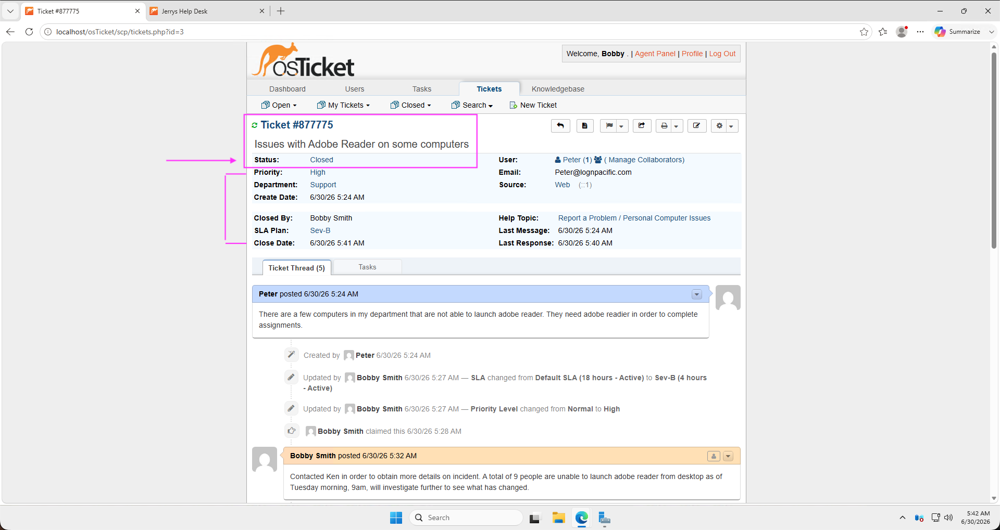
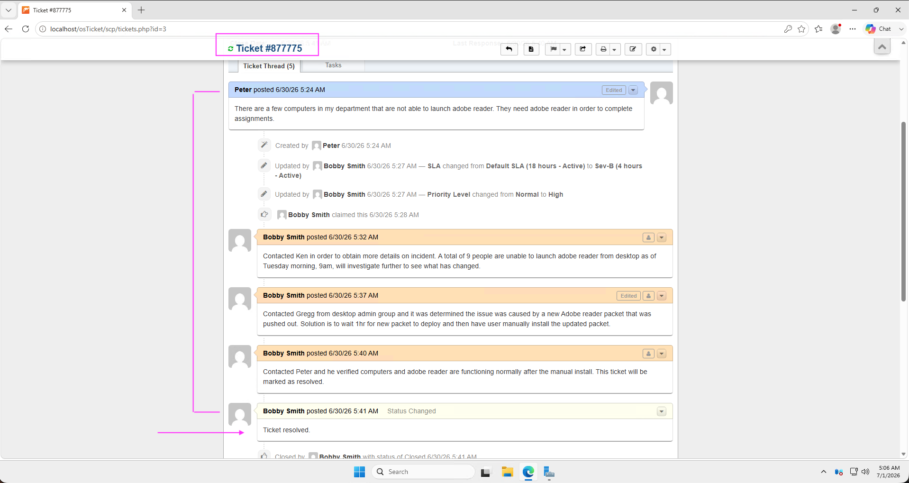

<h1>osTicket - Ticket Lifecycle: Intake Through Resolution</h1>
This tutorial outlines the lifecycle of a ticket from intake to resolution within the open-source help desk ticketing system osTicket. 

<h2>Environments and Technologies Used</h2>

- Microsoft Azure (Virtual Machines/Computer)
- Remote Desktop
- Internet Information Services (IIS)
- osTicket v1.15.8

<h2>Operating Systems Used </h2>

- Windows Server 2025 Datacenter</b> (21H2)

<h2>Ticket Lifecycle Stages</h2>

- Intake
- Assignment and Communication
- Working the Issue
- Resolution

<h2>Lifecycle Stages</h2>

#### 1. Intake

*Figure 1: The osTicket Agent Dashboard (Agent "Bobby") displaying a newly created ticket.*

*Figure 2: The User Portal submission form used to initiate a new support request.*

*Figure 2(a): The confirmation screen indicating a successful ticket submission.*

#### 2. Triage, Assignment, and Communication

*Figure 3: Triaging the ticket, assignments include priority, SLA, department and agent. Status set to "closed" as ticket was resolved in this example.*

#### 3. View of ticket thread towards resolution

*Figure 3(a): Documenting troubleshooting steps and internal notes within the ticket thread.*

*Project completed by Gerardo Madera. © 2026  All rights reserved.*
